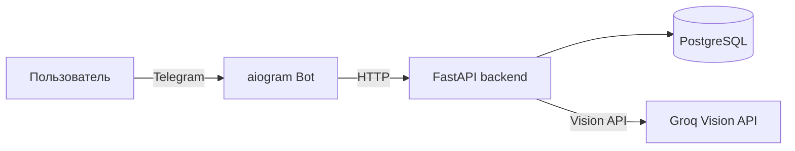
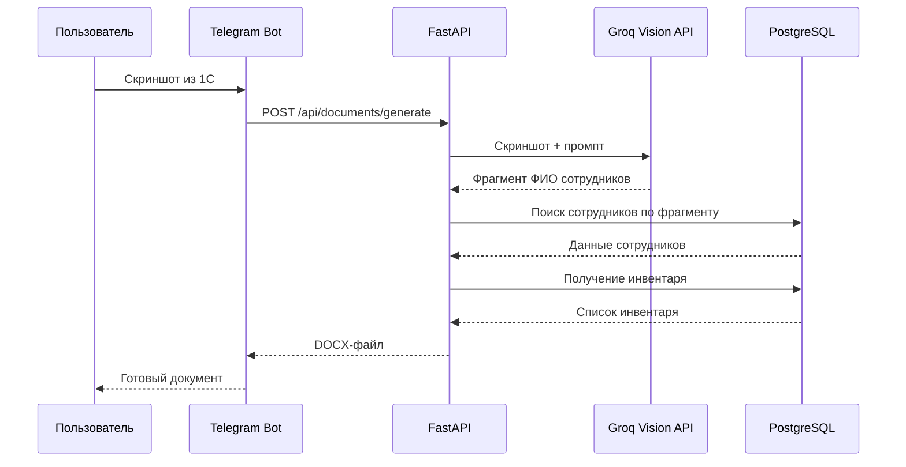

# Tool Issuance Bot
 
>Telegram-бот для автоматической генерации документов (актов приёма-передачи).
 
[](https://www.python.org/)
[](https://fastapi.tiangolo.com/)
[](https://www.postgresql.org/)
[](https://docs.aiogram.dev/)
[](https://www.groq.com/)
[](https://www.docker.com/)
[](https://docs.pytest.org/)

## Зачем это нужно
 
Бухгалтер регулярно составляет акты приёма-передачи (вручную переносит данные из 1С / Excel в Word). Это рутинная работа – отнимает время + вероятность ошибки при копировании. 

Бот автоматизирует этот процесс:

1. Принимает Excel-справочник с данными сотрудников (один раз)
2. Принимает Excel-выгрузку из 1С (ежемесячно)
3. По скриншоту из 1С ищет сотрудника и генерирует готовый DOCX
## Стек
 
| Слой            | Технология              |
|-----------------|-------------------------|
| Backend         | FastAPI                 |
| БД              | PostgreSQL              |
| AI              | Groq API (vision)       |
| Telegram-бот    | aiogram 3               |
| Работа с Excel  | openpyxl                |
| Генерация DOCX  | docxtpl                 |
| ORM             | SQLAlchemy (async)      |
| Миграции        | Alembic                 |
| Тесты           | pytest + pytest-asyncio |
| Контейнеризация | Docker + docker-compose |
 
## Архитектура



**Диаграмма потока генерации документа:**
 


## Структура проекта
 
```
tool-issuance-bot/
├── bot/                    # Telegram-бот (aiogram)
│   ├── main.py
│   ├── states.py           # FSM-состояния
│   └── handlers/
│       ├── commands.py     # /update_directory, /update_inventory, /generate
│       └── document.py     # Обработка файлов и скриншотов
│
├── api/                    # REST API (FastAPI)
│   ├── main.py
│   ├── crud/               # Работа с БД
│   ├── schemas/            # Pydantic-схемы для валидации данных
│   └── routers/            # Эндпоинты
│
├── services/               # Бизнес-логика
│   ├── ai_extractor.py     # Groq Vision: извлечение данных
│   ├── excel_parser.py     # Парсинг Excel-файлов
│   └── docx_generator.py   # Генерация DOCX по шаблонам
│
├── models/                 # SQLAlchemy-модели
├── migrations/             # Alembic-миграции
├── templates/              # Word-шаблоны (не в репозитории)
├── tests/                  # pytest тесты
├── docker-compose.yml
├── Dockerfile
├── requirements.txt
├── README.md
└── .env.example
```
 
## Запуск
 
### 1. Предварительные требования
 
- Docker и docker-compose
- Токен Telegram-бота ([BotFather](https://t.me/BotFather))
- API-ключ Groq ([console.groq.com](https://console.groq.com))
### 2. Настройка окружения
 
```bash
cp .env.example .env
```
 
Заполните `.env`:
 
```env
BOT_TOKEN=your_telegram_bot_token
GROQ_API_KEY=your_groq_api_key
```
 
### 3. Добавьте Word-шаблоны
 
Положите файлы шаблонов в папку `templates/`:
- `single_employee.docx` – для одного сотрудника
- `two_employees.docx` – для двух сотрудников
- `three_employees.docx` – для трёх сотрудников

### 4. Запуск
 
```bash
docker-compose up --build
```

Миграции применяются автоматически при старте контейнера `api`.
 
## Команды бота
 
| Команда             | Описание                                                                                        |
|---------------------|-------------------------------------------------------------------------------------------------|
| `/update_directory` | Загрузить Excel-справочник сотрудников. Заменяет все существующие записи.                       |
| `/update_inventory` | Загрузить Excel-выгрузку из 1С с инвентарем за текущий месяц. Заменяет все существующие записи. |
| `/generate`         | Отправить скриншот из 1С → получить готовый DOCX.                                               |
 
**Формат поля «Комментарий» на скриншоте:**
- Один сотрудник: `Иванов`
- Двое: `Иванов / Петров`
- Трое: `Иванов / Петров / Сидоров`
## API
 
Бот общается с FastAPI через HTTP. Эндпоинты доступны на `http://localhost:8000`.
 
### Сотрудники `/api/employees`
 
| Метод    | Путь                                   | Описание                   |
|----------|----------------------------------------|----------------------------|
| `GET`    | `/api/employees/`                      | Список всех сотрудников    |
| `POST`   | `/api/employees/`                      | Создать сотрудника         |
| `DELETE` | `/api/employees/`                      | Удалить всех сотрудников   |
| `GET`    | `/api/employees/search?employee_name=` | Поиск по фрагменту фамилии |
| `POST`   | `/api/employees/upload`                | Загрузить Excel-справочник |
 
### Инвентарь `/api/inventories`
 
| Метод    | Путь                               | Описание                          |
|----------|------------------------------------|-----------------------------------|
| `GET`    | `/api/inventories/?employee_name=` | Инвентарь сотрудника              |
| `POST`   | `/api/inventories/`                | Добавить позицию                  |
| `DELETE` | `/api/inventories/`                | Удалить весь инвентарь            |
| `POST`   | `/api/inventories/upload`          | Загрузить Excel-файл с инвентарем |
 
### Документы `/api/documents`
 
| Метод  | Путь                      | Описание                        |
|--------|---------------------------|---------------------------------|
| `POST` | `/api/documents/generate` | Принять скриншот → вернуть DOCX |
 
Интерактивная документация: `http://localhost:8000/docs`
 
## Тесты
 
```bash
pip install -r requirements.txt
pytest
```
 
Покрыты:
- Парсинг Excel-справочника и выгрузки из 1С (`test_excel_parser.py`)
- Генерация DOCX для одного / двух / трех сотрудников (`test_docx_generator.py`)
- AI-извлечение данных из скриншота (`test_ai_extractor.py`)
- CRUD-операции для сотрудников и инвентаря (`test_employee_crud.py`, `test_inventory_crud.py`)
> `test_ai_extractor.py` делает реальные запросы к Groq API, поэтому для запуска нужен `GROQ_API_KEY` в `.env`.

> CRUD-тесты используют отдельную тестовую БД PostgreSQL (`TEST_DB_NAME` в `.env`). БД создается вручную:
> `docker exec -it tool_issuance_db psql -U <DB_USER> -c "CREATE DATABASE tool_issuance_test;"`